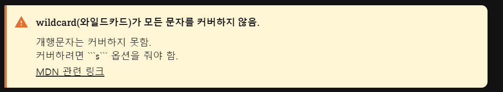

# Blog

저의 개발 블로그 입니다.

이 [링크](https://codeleeks.github.io/blog/)로 접속하여 구경해 보세요.

     

## 개발 기록

### 포스트 보여주기

`markdown`으로 작성하고 깃헙에 업로드하면, 이를 가져와 `react-markdown`으로 보여준다.

커스텀 스타일링을 거의 하지 않고, 제공되는 라이브러리를 사용했다.

- `rehype-highlight, highlight.js, rehype-raw`

### 목차(Table Of Contents) 만들기

#### 정규표현식

`heading`만을 추출하여, \# 갯수(level)와 heading 텍스트를 객체로 저장한다.

level에 따라 `padding-left`를 다르게 적용한다.

`React-Markdown`이 html 변환 과정에서 삽입한 id와 동일하게 href에 지정하기 위해 `rehype-slug`가 내부적으로 사용하는 `github slugger`를 anchor의 href로 지정한다.

#### gsap을 통한 scroll 애니메이션

요소 클릭시 handler에서 `gsap.to` 호출한다.

`gsap`을 통해 부드러운 스크롤 애니메이션을 구현했다.

#### sticky로 뷰포트에 고정하기

`flex`로 nav, section, aside(목차)를 나눈 상태에서 nav와 aside 영역을 sticky로 지정하려 한다.

교차축 정렬이 `stretch`로 되어 있기 때문에 주어진 height를 다 쓴다.

이렇게 되면 sticky 오퍼레이션이 적용되지 않는다.

`align-items: flex-start`로 height를 컨텐츠만큼 줄여준다.

### 메시지 박스 만들기

메시지 박스는 Notice나 주의 사항을 표시하는 안내문을 말한다.

<메시지박스예시>

#### React Markdown feasibility

아쉽게도 특정 문자열 패턴에 대한 컴포넌트 주입 기능은 없었다.

그래서 리액트 컴포넌트로 만들 수 없었고, 문자열 보간으로 구현했다.

#### 유틸리티 함수 작성

포스트에 `///`라고 작성하면, 이를 메시지 박스 영역으로 가정한다.

해당 영역들을 포스트에서 모두 찾아서 필요한 내용을 추출했다.

메시지 박스 영역을 찾는 방법은 `indexOf`를 활용했고, 메시지 박스 안에서 필요한 내용을 추출하는 방법은 정규표현식을 사용했다.

하나의 정규식으로 메시지 박스 영역과 필요 내용을 추출하는 것은 쉽지 않았다.

#### 스타일링

메시지 유형(레벨)을 나타내는 아이콘과 제목 부분 높이를 맞추는 게 핵심이다.

제목 부분은 `padding`으로 박스 내에서 위치를 잡았다. 아이콘은 `before` 가상클래스를 사용하고, `absolute` 포지션을 통해 위치를 잡아 제목 부분과 높이를 맞췄다.

### PostPage 만들기

`flex` 컨테이너 내의 아이템은 `sticky` 포지션이더라도 flex 영역을 차지한다.

반응형을 위해 nav, aside 영역을 숨겨야 할 때, `translate`로 옮겨도 이전 영역을 차지하고 있다.

방법은 `fixed`로 flex 밖으로 벗어나 버린다.

`sticky` 영역은 블록 쌓임 맥락을 지키면서 위치를 잡는다. 상위에 블록 요소가 있을 때 그 height의 밑에 쌓이게 된다. 스크롤 요소가 body이고 `top: 0`으로 잡아도 상위 블록 요소의 height 위치에 자리잡는다.

### navigation Toggling UI 만들기

nav 요소는 scroll-contents, toggler, bg 로 구성한다.

nav는 flex로 지정하여 각 자식 요소를 가로로 배치한다.

nav는 sticky, toggler는 absolute, bg는 fixed로 위치를 잡는다.

scroll-contents는 특정 화면 너비에 진입하면 `translate(-100%, 0)`을 통해 화면 밖으로 이동하고(사라지고), nav는 fixed로 변경된다. 이에 따라 toggler는 nav의 위치 기준으로 위치를 변경한다.(최좌측)

toggler를 클릭하면 nav의 class에 `nav--open`을 토글하여, scroll-contents가 `translate(0,0)` 을 통해 제자리로 돌아온다.

- 돌아올 때는 toggler가 바로 우측에 위치할 수 있도록 scroll-contents의 width를 지정해준다.

z-index는 쌓임 맥락에 따라 bg가 다른 요소를 흐림 처리할 수 있도록 적당히 지정한다.

### anchor를 통한 heading 이동시 강조 애니메이션 추가

table of contents에서 특정 anchor 클릭시 상응하는 heading으로 스크롤한다.

이 때, 해당 heading에 highlight 컬러를 씌워서 스크롤하는 목표가 해당 요소임을 보여준다.

component 내의 로컬 변수로 slug를 저장하려고 했으나 실패했다.

- useRef는 타이머를 잘 제거했지만, 문자열 변수는 이전 값을 제대로 저장하지 못했다.
- local 변수로도 처리할 수 없었다.

전역 변수로 처리하여 이전 slug의 클래스를 제거했다.

### 배포

배포는 `github pages`를 사용했다.

메인 브랜치에 머지 혹은 푸시가 발생하면, `vite`에서 제공하는 github action 스크립트를 통해 페이지를 배포한다.

## 리팩토링

프로토타입 개발 완료 후 리팩토링을 진행합니다.

- SCSS 파일을 기능 별로 분리
- 컴포넌트 재사용
- 불필요 코드 제거

### SCSS 파일 분리

scss에서는 `partials`를 지원한다.

파일을 분리하되, 각 파일을 컴파일하지 않고 하나의 scss로 만든 뒤 컴파일한다.

성능, 관리 상의 이점을 볼 수 있다.

메인 파일 이외의 scss 파일은 이름 앞에 `_`를 붙인다.

#### 이슈

vscode에서 css variable의 code navigtaion이 동작하지 않는다.

깃헙에 [이슈](https://github.com/microsoft/vscode/issues/212064) 제기를 한 상태이다.

workaround로는 scss variable를 쓰는 방법이 있다.
